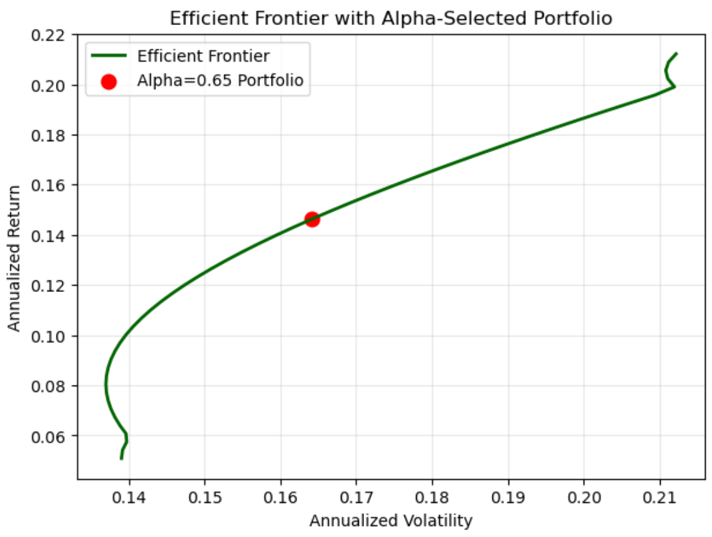
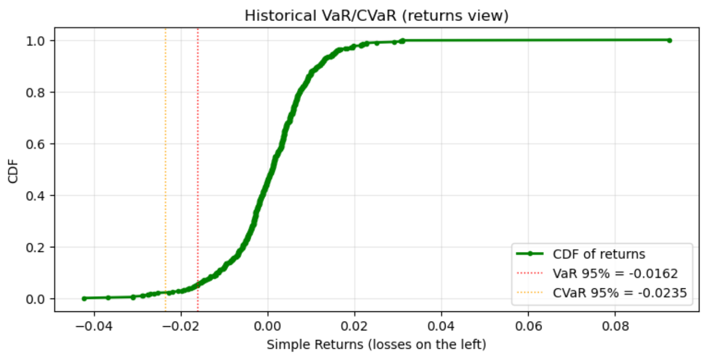
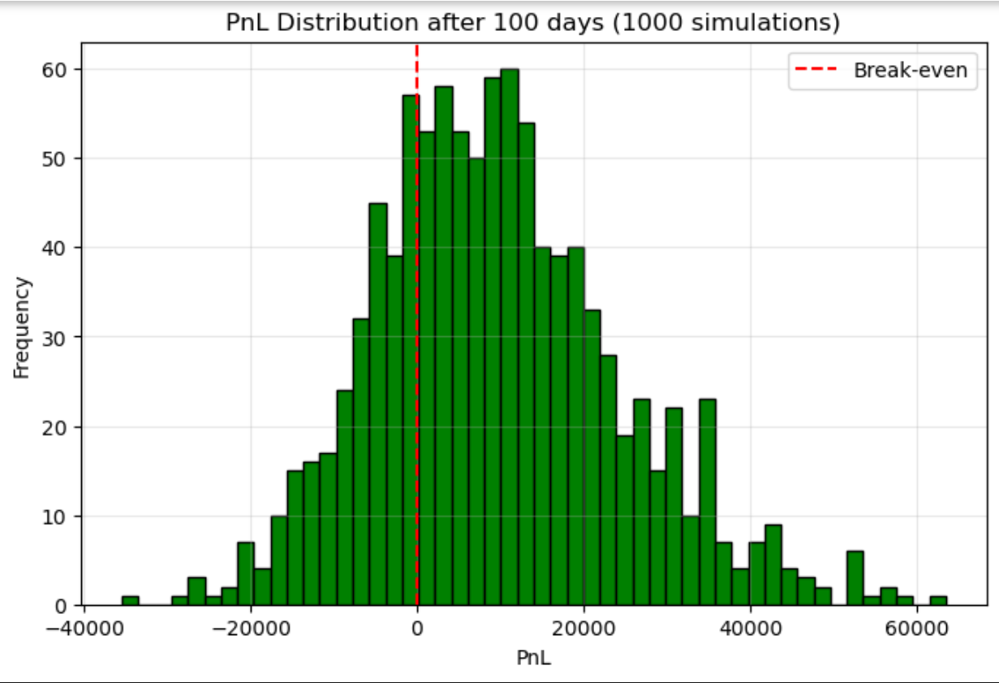
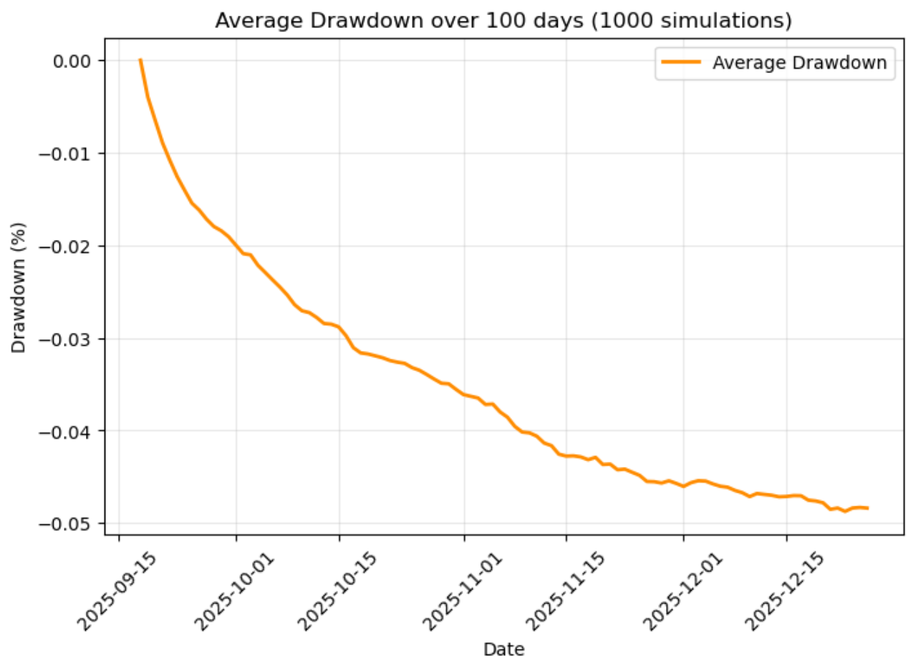

# Multi-asset Portfolio Analytics : Optimisation, Risk & Monte Carlo Simulation

[](https://www.python.org/)
[](LICENSE)
[]()

## Overview
End‑to‑end Python framework for **multi‑asset portfolio construction**, **efficient frontier optimisation**, and **multi‑method risk analysis** (historical, parametric, Monte Carlo VaR & CVaR), with **forward price simulation**, **PnL distribution**, and **drawdown analysis**.

## Features

- **Portfolio Optimisation**
  - Constraint-based portfolio optimisation : Build portfolios under long‑only or short‑allowed constraints
  - Weighted objective selection : User inputs a value between **0** (pure minimum volatility) and **1** (pure maximum Sharpe ratio) to **balance risk and return**
  - Efficient Frontier plotting : Visualise the trade‑off between risk and return for the optimised portfolios

- **Risk Analysis**
  - Historical VaR & CVaR
  - Parametric VaR & CVaR (Normal, time scaling)
  - Monte Carlo VaR & CVaR

- **Forward Simulation**
  - Monte Carlo price projection
  - PnL distribution with probability of loss
  - Drawdown trajectories and max drawdown stats

- **Visualisations**
  - Efficient Frontier with clear labels
  - Loss distribution CDFs
  - Monte Carlo fan charts
  - Average drawdown curves

- **Export**
  - Excel export of PnL and drawdown results for reporting

## Project Structure

```
multi-asset-portfolio-analytics/
│
├── example.ipynb                   # Interactive demo to review code and features 
├── utils.py                        # All used libraries and usefull methods
├── portfolio.py                    # Portfolio construction & optimisation
├── risk_analysis.py                # VaR/CVaR calculations
├── simulation.py                   # Monte Carlo simulation, PnL & drawdown
├── test_pipeline.py                # End‑to‑end run
├── requirements.txt                # Python libraries required
├── README.md                       # This file
└── images/
    ├── efficient_frontier.png
    ├── hist_var_cvar.png
    ├── pnl_distributions.png
    └── average_drawdown.png

```

## Requirements
- Python 3.10+
- numpy, pandas, matplotlib, yfinance, scipy

## Installation

```bash
git clone https://github.com/<your-username>/<your-repo>.git
cd <your-repo>
python -m venv venv
source venv/bin/activate   # macOS/Linux
venv\Scripts\activate      # Windows
pip install -r requirements.txt
```

## Example Outputs

### Efficient Frontier


### 


### PnL Distribution


### Average Drawdown


## Next Steps
- Multi‑asset correlated Monte Carlo simulation
- Historical stress testing (2008, 2020)
- Transaction cost modelling

## License
Personal project — free to use and modify for educational or demonstration purposes.
```